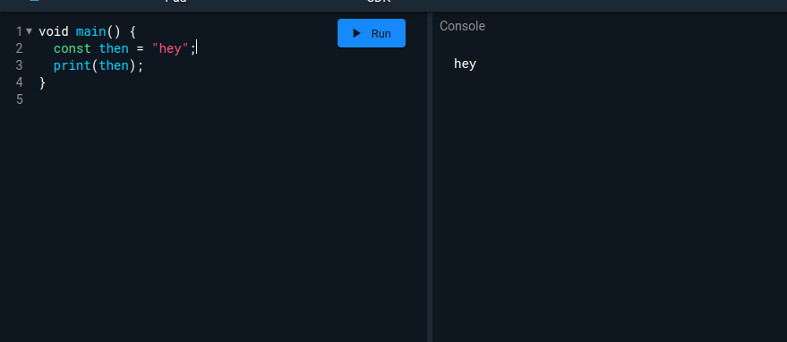

1. Words like 'if', 'else', 'for', 'while' exist in all programming languages and are helpful to control the program flow. These are the keywords are

- valid identifiers everywhere & have special meaning only in specific places (contextual keywords),
- Valid identifiers but cannot be used as class or type names or import prefixes (built-in identifiers)
- Invalid identifiers (reserved words)
- none of the above
<!-- - limited reserved words  has to be excluded from the list to avoid confusion for beginners-->

2.

 

Assignment 1
https://docs.google.com/document/d/1C_xCz_MGGRtDQOShN79wKNiWhhfkCqe1sZgQuC8mSiE/edit
Which of the following widgets does not have any “child” property?
Container
Scaffold
SafeArea
Center

To which of the following widgets, can we pass more than one widget as property?
Container
Scaffold
SafeArea
Center

Create the following two screens, by just using the margin property, without using the padding property:

( Notice the gap between the orange container
And the appbar )

-------end first assignment
week3 day 1
